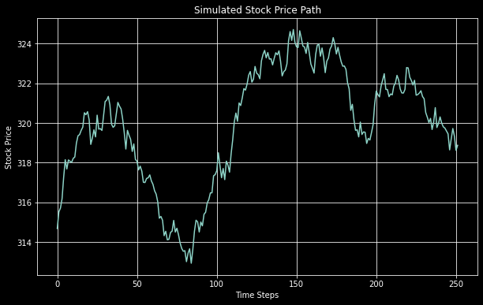

* Introduction
    * Briefly introduce the lognormal distribution and its importance.

In probability theory, a lognormal distribution is a **continuous probability distribution** 
of a **random variable** whose logarithm is **normally distributed**

**Graphical Characteristics**:

1. Shape: The graph of a lognormal distribution is right-skewed, meaning the tail on the right-hand side of the distribution is longer or fatter than the left-hand side. It starts near the origin (0,0) and rises rapidly before slowly tapering off as it moves to the right.

2. Asymmetry: Unlike the normal distribution, which is symmetric around its mean, the lognormal distribution is not symmetric.

3. Bounds: The graph is bounded on the left by zero (since you can't take a logarithm of a negative number or zero in the real number space).

4. Mode, Median, Mean: The mode (the peak of the distribution) is always at a value less than the median, and the median is less than the mean. This is a direct result of the distribution being right-skewed.

5. Spread: The spread of the distribution is controlled by the standard deviation of the underlying normal distribution of its logarithm (we'll see how that happens in a bit). A higher standard deviation results in a "fatter" tail and a wider spread.

6. Mathematical Parameters:
    - $\mu$: The mean of the natural logarithm of the variable, not the mean of the variable itself.
    - $\sigma$: The standard deviation of the natural logarithm of the variable.

If you're wondering what the Probability Density Function looks like mathematically:
$$
    f(x;\mu,\sigma^2) = \frac{1}{x\sigma \sqrt{2\pi}} \exp\left(-\frac{(\ln x - \mu)^2}{2\sigma^2}\right); x>0
$$

#Why is this important

**Sliders**

<!-- Add HTML Sliders -->

  <label for="mu-slider">Mu: </label>
  <input type="range" id="mu-slider" min="-5" max="5" step="0.1" value="0">
  <label for="sigma-slider">Sigma: </label>
  <input type="range" id="sigma-slider" min="0.1" max="5" step="0.1" value="1">

<!-- Add SVG containers for Graphs -->

  <svg id="normal-graph" width="400" height="300"></svg>
  <svg id="lognormal-graph" width="400" height="300"></svg>

<!-- Include D3.js Library -->

<!-- JavaScript Code to Generate Graphs -->

Caution! The $\mu$ and $\sigma$ here are not the same as the ones used to describe a normal distribution. The parameters here represent the mean and variance of the log-transformed distribution (which is normal). What does that mean for their relevance to the lognormal distribution? They're simply two parameters we use to define what the distribution graph looks like.

**Okay what do I do with this information?**

One area where lognormal distributions are widely used is Finance, particularly in the modelling of stock prices.

Why is it that lognormal distributions are a good fit here?
1. Stock prices can't be negative.
2. Stock prices often exhibit a constant percentage rate of return (drift) and a constant percentage rate of volatility, percentage changes for which can be modeled as being lognormally distributed.
3. Over time, the returns from a stock are compounded, resulting in multiplicative effects that are better modeled by a lognormal distribution than by a normal distribution.

**In action**

Let's take a look at Meta's stock prices. We'd first need to validate whether stock returns are lognormal, in which case we can use the Black-Schole-Merton model, which assumes ...[COME BACK]

The histogram doesn't look very normal. How do we test for that?

A few tests we could do to determine this:
1. Shapiro-Wilk Test for Normality:
    - This value is a test statistic that ranges from 0 to 1. A value close to 1 typically indicates that the data follows a normal distribution.
    - A value of 0.748 is considerably far from 1, indicating that the data likely deviates significantly from a normal distribution.
2. P Value: 
    - The p-value is a measure of the evidence against the null hypothesis, which in this case is that the data is normally distributed.
    - A commonly used threshold for the p-value is 0.05. If the p-value is less than this, the null hypothesis is rejected.
    - Your p-value is extremely close to zero (
providing strong evidence against the data being normally distributed.
3. Skewness:
    - Skewness measures the asymmetry of the data around the mean.
    - A skewness of 0 indicates a perfectly symmetrical data distribution.
    - Negative skewness indicates that the data is skewed to the left. In your case, a skewness of -1.35 is a strong indicator of left skewness.
4. Kurtosis: 28.865309772164203
    - Kurtosis measures the "tailedness" of the distribution.
    - A kurtosis of 0 indicates a normal distribution. Positive kurtosis indicates a "leptokurtic" distribution with fatter tails, and negative kurtosis indicates a "platykurtic" distribution with thinner tails.
    - Your kurtosis value is extremely high (28.87), indicating very fat tails.

All of these tests indicate, that, well, our distribution isn't normal. Bummer. But since we've already invested in the stock, let's pretend that all our tests passed and daily returns DO follow a normal distribution. What should we do next? We model stock prices!

The stochastic differential equation often used in the Black-Scholes-Merton model is:

$$
dS_t = \mu S_t \, dt + \sigma S_t \, dW_t
$$

1. Drift: The $\mu S_t \, dt$ part is the expected drift of a stock price over an infinitesimal period of time ($dt$)
2. Diffusion: The $\sigma S_t\, dW_t$ part is randomness injected into the equation (which - you guessed it! - follows a normal distribution), where $dW_t$ is an infinitesimal increment of a Wiener process (Brownian motion)

Doing that for our stock gives price movement

Generate these simulations thousands of times and the average of all those will give you an estimate of what the stock price trajectory might look like. 

Over time, as you gather more data points, you would be in a position to validate your simulations against reality and hopefully you're not too far off the mark. While this an overly simplistic model, I encourage you to explore more of the adjustments finance bros make to the model in an attempt to make the Oracle of Delphi shy.

We see lognormal distrubitions in many walks of life [add more examples] and 
​
 

